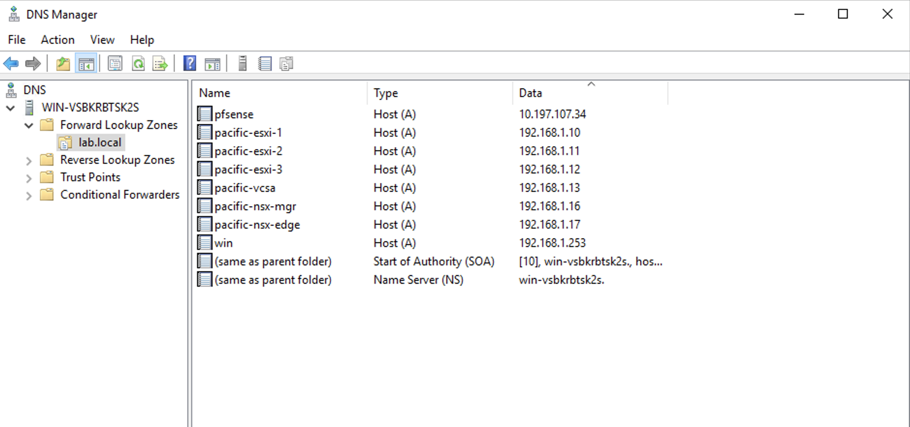
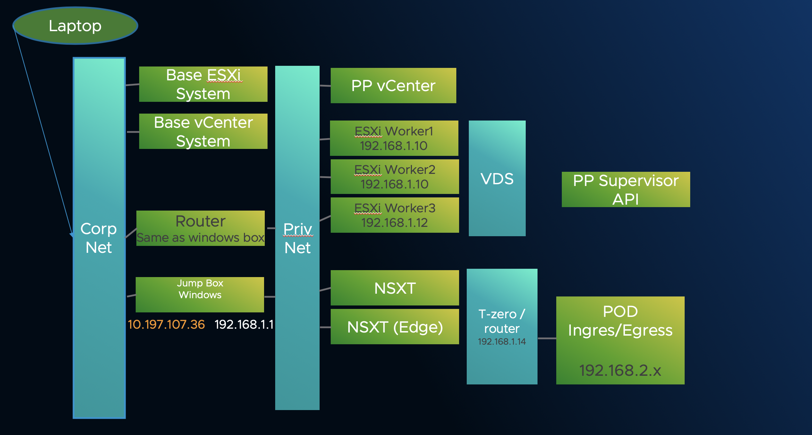
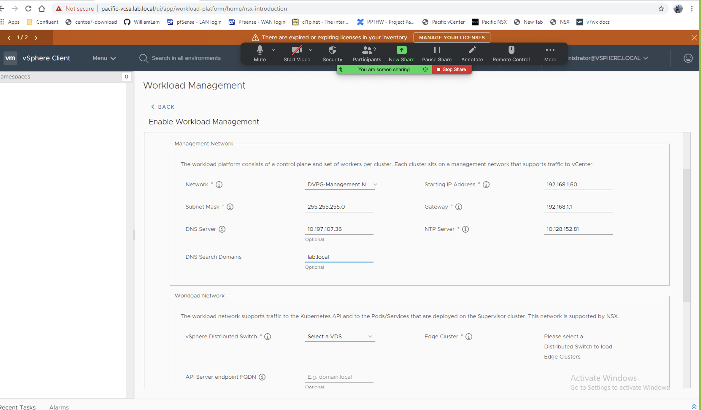
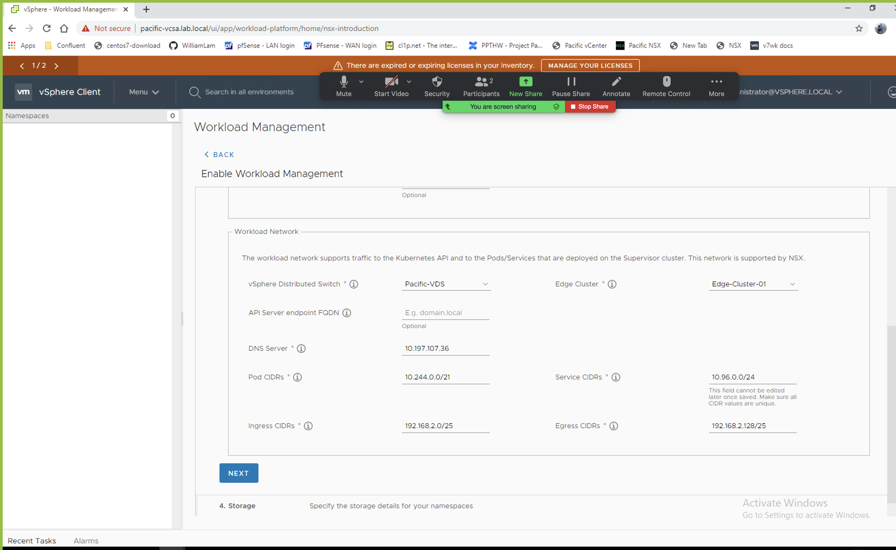

# Notes on HAAS Build PS1 script
** Reference the PS1 script HAAS-Build_Works.ps1. Use these notes to Customize it. :small_red_triangle:

## PRE-REQ's

- Jump Box - I used Windows  that was on both Priv and Public networks. The Private Vlan was the one Pacific ws installed into.
- Router – I used a Windows box as Router / DNS.  We have also tested with PFSense / CentOS as routers.
:small_red_triangle: Make sure to put a test server on the Public / private VLan to test access ahead of time
- DNS – Local Window with labs.local domain
- Vcenter


## DNS settings.
** I used my Windows box with Lab.local domain. Make sure these entries are present :small_red_triangle:BEFORE you kick off the script.



## Topology


---

## vCenter Server

** Change values // shows with red triangles

- $VIServer = "10.197.107.35" :small_red_triangle:
- $VIUsername = "administrator@vsphere.local" :small_red_triangle:
- $VIPassword = "VMware1!" :small_red_triangle:

## ISO bits

- $NestedESXiApplianceOVA = "F:\Nested_ESXi7.0_Appliance_Template_v1.ova"
- $VCSAInstallerPath = "E:\" { This gets mounted to the local folder. Click on the VMware VCSA iso to mount} :small_red_triangle:
- $NSXTManagerOVA = "F:\nsx-unified-appliance-3.0.0.0.0.15946739.ova"
- $NSXTEdgeOVA = "C:\Users\Administrator\Downloads\nsx-edge-3.0.0.0.0.15946012.ova"


## Nested ESXi VMs to deploy

```
$NestedESXiHostnameToIPs = @{
    "pacific-esxi-1" = "192.168.1.10"
    "pacific-esxi-2" = "192.168.1.11"
    "pacific-esxi-3" = "192.168.1.12"
}
```

## Nested ESXi VM Resources
```
$NestedESXivCPU = "8"
$NestedESXivMEM = "24" #GB
$NestedESXiCachingvDisk = "8" #GB
$NestedESXiCapacityvDisk = "140" #GB
```

## VCSA Deployment Configuration

```
$VCSADeploymentSize = "tiny"
$VCSADisplayName = "pacific-vcsa"
$VCSAIPAddress = "192.168.1.13"
$VCSAHostname = "pacific-vcsa.lab.local" #Change to IP if you don't have valid DNS
$VCSAPrefix = "24"
$VCSASSODomainName = "vsphere.local"
$VCSASSOPassword = "VMware1!"
$VCSARootPassword = "VMware1!"
$VCSASSHEnable = "true"
```

### Customize these to your DC Settings :o:
#### General Deployment Configuration for Nested ESXi, VCSA & NSX VMs

!! Using a Windows Router / Dns server in one box saves IP.

- $VMDatacenter = "DC242" :small_red_triangle:
- $VMCluster = "cluster242" :small_red_triangle:
- $VMNetwork = "internal-portgroup" :small_red_triangle:
- $VMDatastore = "datastore4" :small_red_triangle:
- $VMNetmask = "255.255.255.0"
- $VMGateway = "192.168.1.1" ** Router. Make sure its connected to both public and pvt and routes :small_red_triangle:
- $VMDNS = "10.197.107.36" :small_red_triangle:
- $VMNTP = "10.128.152.81" :small_red_triangle:
- $VMPassword = "VMware1!"
- $VMDomain = "lab.local" :small_red_triangle:
- $VMSyslog = "192.168.1.13"
- $VMFolder = "Project-Pacific"
--------


## Applicable to Nested ESXi only
```
$VMSSH = "true"
$VMVMFS = "false"
```


## Name of new vSphere Datacenter/Cluster when VCSA is deployed

```
$NewVCDatacenterName = "Pacific-Datacenter"
$NewVCVSANClusterName = "Workload-Cluster"
$NewVCVDSName = "Pacific-VDS"
$NewVCDVPGName = "DVPG-Management Network"
```

## Pacific Configuration
```
$StoragePolicyName = "pacific-gold-storage-policy"
$StoragePolicyTagCategory = "pacific-demo-tag-category"
$StoragePolicyTagName = "pacific-demo-storage"
$DevOpsUsername = "devops"
$DevOpsPassword = "VMware1!"
```

## NSX-T Configuration
```
$NSXLicenseKey = "3N2KN-8EHD1-38970-01CKP-04R6Q"
$NSXRootPassword = "VMware1!VMware1!"
$NSXAdminUsername = "admin"
$NSXAdminPassword = "VMware1!VMware1!"
$NSXAuditUsername = "audit"
$NSXAuditPassword = "VMware1!VMware1!"
$NSXSSHEnable = "true"
$NSXEnableRootLogin = "true"
$NSXVTEPNetwork = "internal-VTEP"

```

## Transport Node Profile
```
$TransportNodeProfileName = "Pacific-Host-Transport-Node-Profile"
```

## TEP IP Pool
```
$TunnelEndpointName = "TEP-IP-Pool"
$TunnelEndpointDescription = "Tunnel Endpoint for Transport Nodes"
$TunnelEndpointIPRangeStart = "172.30.1.10"
$TunnelEndpointIPRangeEnd = "172.30.1.20"
$TunnelEndpointCIDR = "172.30.1.0/24"
$TunnelEndpointGateway = "172.30.1.1"
```

## Transport Zones
```
$OverlayTransportZoneName = "TZ-Overlay"
$OverlayTransportZoneHostSwitchName = "nsxswitch"
$VlanTransportZoneName = "TZ-VLAN"
$VlanTransportZoneNameHostSwitchName = "edgeswitch"

```

## Network Segment
```
$NetworkSegmentName = "Pacific-Segment"
$NetworkSegmentVlan = "0"

```

## T0 Gateway
```
$T0GatewayName = "Pacific-T0-Gateway"
```
$T0GatewayInterfaceAddress = "192.168.1.14" ## should be a routable address :small_red_triangle:
```
$T0GatewayInterfacePrefix = "24"
$T0GatewayInterfaceStaticRouteName = "Pacific-Static-Route"
$T0GatewayInterfaceStaticRouteNetwork = "0.0.0.0/0"
$T0GatewayInterfaceStaticRouteAddress = "192.168.1.1"
```

## Uplink Profiles
```
$ESXiUplinkProfileName = "ESXi-Host-Uplink-Profile"
$ESXiUplinkProfilePolicy = "FAILOVER_ORDER"
$ESXiUplinkName = "uplink1"

$EdgeUplinkProfileName = "Edge-Uplink-Profile"
$EdgeUplinkProfilePolicy = "FAILOVER_ORDER"
$EdgeOverlayUplinkName = "uplink1"
$EdgeOverlayUplinkProfileActivepNIC = "fp-eth1"
$EdgeUplinkName = "tep-uplink"
$EdgeUplinkProfileActivepNIC = "fp-eth2"
$EdgeUplinkProfileTransportVLAN = "0"
$EdgeUplinkProfileMTU = "1600"
```


## Edge Cluster

```
$EdgeClusterName = "Edge-Cluster-01"
```

## NSX-T Manager Configurations
```
$NSXTMgrDeploymentSize = "small"
$NSXTMgrvCPU = "6" #override default size
$NSXTMgrvMEM = "24" #override default size
$NSXTMgrDisplayName = "pacific-nsx-mgr"
$NSXTMgrHostname = "pacific-nsx-mgr.lab.local"
$NSXTMgrIPAddress = "192.168.1.16" :small_red_triangle:
```

## NSX-T Edge Configuration
```
$NSXTEdgeDeploymentSize = "large"
$NSXTEdgevCPU = "8" #override default size
$NSXTEdgevMEM = "32" #override default size
$NSXTEdgeHostnameToIPs = @{
    "pacific-nsx-edge" = "192.168.1.17" :small_red_triangle:
}
```

## Advanced Configurations
## Set to 1 only if you have DNS (forward/reverse) for ESXi hostnames
$addHostByDnsName = 1

## Enable Workload screen values

** SCREEN 1



** SCREEN 2


